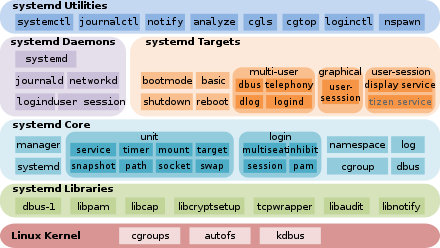

# Server Architecture and Image Design
___
This chapter describes how the process structure on our Server manage the running container through systemd and monit. And how to use s6 as PID 1 to manage the processes in the container, these processes include WSGI server, Rsyslog, Cron, etc.

When an external HTTP request comes in, nginx managed by systemd is can redirect the request into the container, and the request will be processed by the WSGI server inside the container.

Since the architecture design of Image is independent of each layer, and a self-installation script is added, the Image can be installed and managed by itself. The following will illustrate the usage and architecture design.

## Components Used by the Process Structure
___
### Architecture Diagram
The figure below shows the process management structure of the Server managed by nuwa.


It can be simply divided into four categories of components: Systemd, Nginx, Rsyslog and Cron, which will be introduced as follows.


### Systemd (process management)
- **Systemd**  
  Systemd is a default init program for most Linux systems. In addition to the originally designed process management, with the evolution of the times, the team led by Lennart has added many additional functions, such as log management, connected device management, power management, and scheduled tasks. Although it provides more features, it also makes the package more redundant.
  
    
- **s6**  
  Since systemd is too redundant, s6 is one of the process management more bug-free, lightweight and easy to understand than systemd. It is consists of four core components: s6-supervise, s6-svc, s6-svscan and s6-svscanctl.  
  - s6-supervise: monitor long-term process, which is the last non-leaf branch of a supervision tree of the s6 monitoring tree. The leaf node is the long-term process managed by s6-supervise.
  - s6-svc: send instructions to the executing s6-supervise.
  - s6-svscan: activate and monitor s6-supervise, which is the root of the entire s6 monitoring or its branch.
  - s6-svscanctl: send instructions to the executing s6-svscan.  
- **Systemd vs. s6 (lightweight tradeoff)**  

  |           | Systed                                                    | s6                 |
  | ----------| --------------------------------------------------------- | ------------------ |
  | function  | process management, <br>log management, periodical tasks  | process management |
  | property  | large and complex                                         | small and simple   |

- **s6-overlay**  
  s6-overlay is a GitHub open-source project designed to help developers quickly and conveniently install s6 in any Linux container, and it uses s6 as the init of the container to implement the rule of "one thing per container".

### Nginx (reverse proxy)
Nginx is an open-source asynchronous framework web server that can be used for reverse proxy, Http Cache and load balancer. In our company, Nginx is used to directly accessing static files and reversing proxy, which can control each standalone container corresponding to its own respective domain or subdomain.  


### Rsyslog (log management)
Although there is already a standard log management system, SysLog, on Linux, its features are unable to meet the needs of users as time goes by. As a result, the new log management was born, such as Rsyslog and Syslog-ng. Now we use Rsyslog for log integration and management within the container in our company.

### Cron (periodical job scheduler)
Cron is a job scheduler under Unix-like systems, which can be used to initiate periodic detection tasks or tasks at specified time points. Currently in our company., it is mainly used to maintain the time validity of the SSL certificate and to automatically reapply for the SSL certificate periodically on the server. And in the container, the programs that need to be scheduled regularly are defined by app.  


### (Apache + mod_wsgi) & Gunicorn (WSGI Server)
Since the python website development framework, such as Django or flask, is used as a development environment. It is easy to develop and debug, but its performance in security, multi-tasking and reliability is difficult to satisfy the public network. Therefore, it is necessary to replace this development server with formal application (WSGI) Server, such as Gunicorn or mod_wsgi. And use these WSGI Server to connect to web server, such as Apache or Nginx, to implement loading traffic, filtering bad requests and management of multi-tasking in public network.  


### Purpose of the Container Architecture
As above, we can know that in order to reduce the size of container, we replace systemd with s6 in container; use rsyslog to implement log integration management inside container; use cron to manage job scheduler; use Apache or Gunicorn to achieve protection for inner application server. Thus, we make the structure of Image simple and completed.  


## Image Design
___
### Tutorial
1. Create folders in any paths with enough storage space to store the volumes mounted by Container.
1. `export BID= [image id]`, set image id as local variable (can be checked with `podman ps`).
1. ```bash -c "`podman inspect -f '{{json .Config.Labels}}' $BID |jq -r '.[\"Setup\"]'`"```, a bin folder will be generated under the folder after this command, and all shell scripts are stored in this folder. This complex command can be seen in Label RunSetup through `podman inspect [image id]` directly. As result, anyone get this Image can install it by himself.
1. `bin/run` to activate container in the created folder. (do not cd into bin and other locations).
1. Next, `bin/install`, the nginx configuration of container will be installed, so that the worldwide users can connect to the service. The above are installation steps.
1. If you want to remove the container, execute `bin/uninstall` to remove the configuration of the container in the same path as above.
1. And `bin/kill` to remove the container and the bound service (e.g., monit). These two steps are about how to remove the container.
1. Finally, if you want to completely clear the runtime data of the container, you need to `rm -r volumes` to clear the mounted volumes folder. (optional)

### Image Layer


- **app/rockylinux-base**: As a base layer for general projects, common Linux system components, such as s6 (process monitoring), Cron (job scheduler), EPEL (Red Hat system expansion package) and GNUC language pack, are all installed here.
- **app/python-base**: Rocky linux default python (rocky8, 9: python3.9), gcc compilation kit, Apache, miniconda and other commonly used components for python development are installed. This layer is available for lightweight development of non-Django python projects.
- **app/nuwa_python[27|37|38…]**: Create virtual environment (miniconda) required for Django project, set mod_wsgi, install the memory manager, jemalloc, install wkhtmltopdf and other auxiliary website development packages.
- **App/[appName]**: This layer is consisted of the project you want to deploy and the requirement which the project need.

### Encapsulation of Self-Installation Commands (Label of Image)
In order to improve the efficiency and independence of the deployment, we encapsulate the command of deploying this Image as a container and common commands for maintenance in shell scripts. What’s more, we embed the script into the Label of the Image, which is designed for users to activate container without any other installation dependencies. (P.S. Only for hosts initialized to nuwa environment.)

### Pre-encapsulated Commands
Pre-encapsulated Commands are shell scripts which is consist of routine complex commands in our company. The steps for installing a Container are run → install, and the steps for removing a Container are uninstall → kill.

- **run**  
  Copy the initialized volume from Image and set its user permissions, then activate container, create connection between container and DB, and register the container into monit and systemd.
- **install**  
  Register and install SSL certificate, then set up nginx configuration and use Cron to ensure the valid time of the SSL certificate and check the website is work at startup (curl connection). It can only be executed in the upper-level folder of bin, otherwise it will be aborted.
- **uninstall**  
  Stop the running container by systemd, and remove the nginx configuration file.
- **kill**  
  At first, make sure that the user has uninstalled the container (check if the status is stop via systemd), then `podman rm [cid]` to remove the container, and clear the registration in systemd and monit finally.
- **shell**  
  It is used to enter the container, and it is equivalent to the following command.
  `podman exec -it [container id] /bin/bash`
- **archieve_volumes**  
  Generate backups of mounted dynamic data via borg.
- **migrate**  
  First, export volumes as a tar. Then, add permission list and unpack commands in to tar, and gzip to compress the file size. After that, users can transmit the volumes to the remote host through ssh or other network transmission protocols such as scp.
- **others**  
  There are also other commands, such as get_bid (get Image ID), get_cid (get Container ID) and _predicate (environment check). For details, you can see the bin folder which unpack from Image.

## EPEL
___
<https://blog.csdn.net/weixin_41831919/article/details/109035936>

<https://ithelp.ithome.com.tw/articles/10300754>

<https://www.zhihu.com/question/297267614>

<https://medium.com/@eric248655665/%E4%BB%80%E9%BA%BC%E6%98%AF-wsgi-%E7%82%BA%E4%BB%80%E9%BA%BC%E8%A6%81%E7%94%A8-wsgi-f0d5f3001652>

<https://www.zhihu.com/question/35540397>

<https://zh-tw.tenable.com/plugins/nessus/82126>

<https://github.com/twtrubiks/docker-django-nginx-uwsgi-postgres-tutorial>

<https://dreampuf.github.io/GraphvizOnline/>

<https://prasad-k-pawar.medium.com/get-started-with-cron-jobs-linux-617a1c5cc26a>

<https://linuxhandbook.com/nginx-reverse-proxy-docker/>

<https://vicxu.medium.com/web-server-and-application-server-5a6d9c940eff>

<https://achievement.com.sg/view_blog.php?bgid=49&title=Web-server-vs-Application-server,-What%27s-the-difference?>

<https://www.linuxprobe.com/linux-rsyslog-system.html>

<https://medium.com/@federicodeicas/how-to-setup-your-server-with-freenom-tk-82c7302bcce4>

