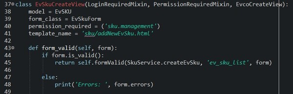
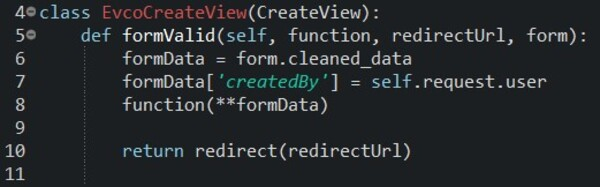

# EvcoViews

There are also shered EvcoCreateView and shared EvcoUpdateView in utils/views/UtilsViews.py (for example, you can refer to the SKU module).
There is a formValid function in these two views. The way to use it is to call formValid() in form_valid of general views, enter form, function to be executed and redirect url as parameters, then formValid will use the form to execute the function and return the url.
**Notion**: In formValid(), the return value of function parameter must be a subclass object of the BaseModel. Sometimes it may be misused as a return value of QuerySet or others, so that this view cannot be used properly, and make fool-proofing program cause errors.

## Instruction of parameter form, fKwargsDict
- In the case of only providing form parameter, formValid will directly access the whole form.cleaned_data to execute the function so form.fields in the template need to be identical to the kwargs in the function.
- If there are some inconsistencies, such as 'form.fields and kwargs of function's name are different', 'there are some fields have to be dealed with  separately', etc., please save the fields that the function will be used to deal with as dict() and use fKwargsDict parameter.
  
  

## Notice
- Both CategoryAttributeValuesCreate/UpdateView have already inherited these two views. If there is inheritance, there is no need to deal with these two views.