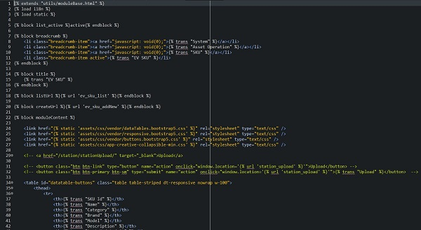
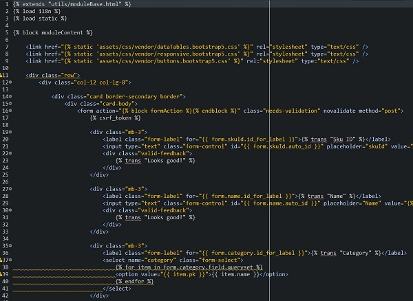
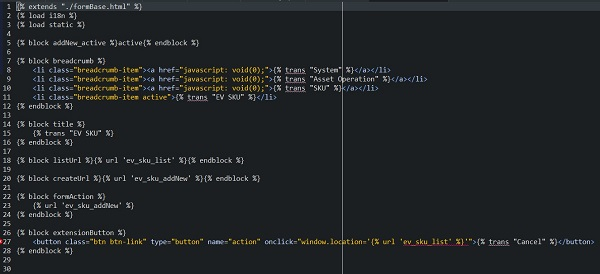

# Template framework

- Since the functions of each module are mainly CRUD, only the architecture of the models is somewhat different, in order to shorten development time, you can use the shared moduleBase.html template (for example, you can refer to the SKU module).
    - If you want to create a new List page, you can directly inherit the utils/moduleBase.html template and just design table in the moduleContent block inside.
    
      
    - If you want to create a new form, (because the for fields between modules are slightly different) you need to make a formBase template that inherits moduleBase first, design form of modules in the moduleContent block, then create another template that inherits the formBase.
    
      
      
      