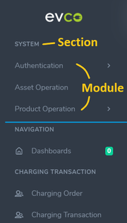

# Procedure for Development
___
## How to add items to the side navigation menu?
- Purpose
In order to connect to development page from the menu, it requires adding corresponding items to the menu on the left side of the screen before developing new pages

- Brief introduction of configuration of the navigation
Items on the menu can be divided into Section and Module. Module is an item linked to each page and it will use Section to classify. In the figure below, the items added by following steps will show in the block above the blue line and which in the block below the blue line are hard-coded and fixed.

  

- Steps
	1. Click ‘Navigation’ under SYSTEM in the menu, it will appear Section and Module. Choose one of them depending on needs. Here takes Module as an example.
	
	1. After clicking ‘Module’, click ‘+ Add new’ on the page, then will enter adding page.
    
        
	1. Fill in relevant information to add successfully. Please note that the Link field must to be identical to the settings in urls.py.
    
        
        
	
		Take Single Product for example. If we want to build the page on the menu with the path ‘Product Operation > Product > Single Product’, we should enter ‘/product/single’ in the Link field, and add ‘path('single', .......)’ to the urls.py of product.
		
## Current approach
Since the present Navigation module is hard-coded, and the permission of the Navigation module needs to be identical to django.auth.models.Permission id to work properly, we currently use the DB table built by Airy to set.

Please use the data in 4 tables in db.zip: systemsetting_navigationmodule, systemsetting_navigationmodule_permission, systemsetting_navigationsection, auth_permission to replace data in your own DB. Also, set required permissions to see navigation you want to the user who wants to use the navigation (or log in directly by using superuser, then you can all navigations directly).

However, the current design shows that there is a flaw in the configuration of navigation. That is, template render of navigation is stored into session at main.views.MainView.home_page(), and the navigation can only be displayed through this view function. Therefore, to display correctly, in addition to preparing above data well, it’s also necessary to access the URL ‘/systemadmin’ to show navigation after login.

In summary, there are three steps to display navigation properly:

1. Use the data in 4 tables in db.zip: systemsetting_navigationmodule, systemsetting_navigationmodule_permission, systemsetting_navigationsection, auth_permission.
1. Set required permissions to the user who wants to show the navigation (or log in by using superuser).
1. Access the URL ‘/systemadmin’ after login, and the navigation will be displayed.