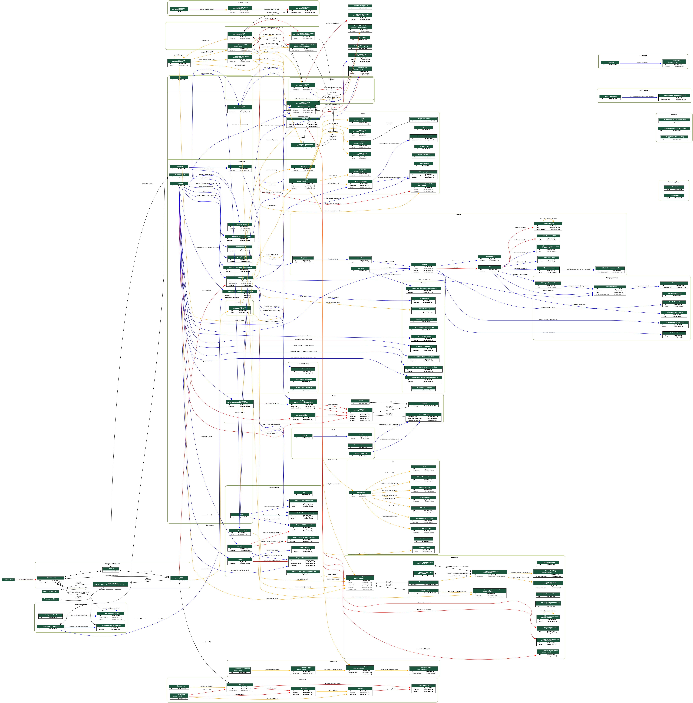

# the following are schema diagrams of our entire application
called using [graph_models (django-extensions)](https://django-extensions.readthedocs.io/en/latest/graph_models.html)

## Note: please create a new workspace for doing this, we do not want to add the following dependencies into our codebase!!

to run, install the following (and of course evco_os/requirements.txt)
```shell
$ sudo apt install graphviz-dev
$ pip install django-extensions
$ pip install pygraphviz
$ pip install pyparsing pydot
```

## 1. detailed schema with all fields (except abstract inherited), ungrouped

This can show us the relationships between models
### args for ``launch.json``:
```json
"args": [
    "graph_models",
    // app labels
    "auth",
    "main",
    "systemsetting",
    "station",
    "customer",
    "chargingservice",
    "pilesimulation",
    "ocppsvr",
    "apisvr",
    "finance",
    "product",
    "mycompany",
    "leasing",
    "sku",
    "asset",
    "iot",
    "category",
    "inventory",
    "delivery",
    "notificationsvr",
    "task",
    "utils",
    "financeinvoice",
    "customid",
    "insurance",
    "workflow",
    "sales",
    "procurement",
    "hubspot_plugin", 
    
    // exclude
    "--exclude-models",
    "BaseModel,LogModel,AddressModel,BillingAddressModel",
    
    // settings
    "--disable-abstract-fields","--disable-sort-fields",
    // "--group-models","--relation-fields-only","RELATION_FIELDS_ONLY",
    "--rankdir","RL",
    "--theme","django2018",
    
    // name
    "--output","evco_os_schema_detailed_nogroup_20230215.png",
],
```

## 2. schema with relationship fields only and grouped by applications

This can show us the dependencies across <b>modules</b>

### args for ``launch.json``:
```json

"args": [
    "graph_models",
    // app labels
    // - same as above - 
    
    // exclude
    // - same as above - 
    
    // settings
    "--disable-abstract-fields","--disable-sort-fields",
    "--group-models","--relation-fields-only","RELATION_FIELDS_ONLY",
    "--rankdir","RL",
    "--theme","django2018",
    
    // name
    "--output","evco_os_schema_relationsonly_group_20230215.png",
],
```
