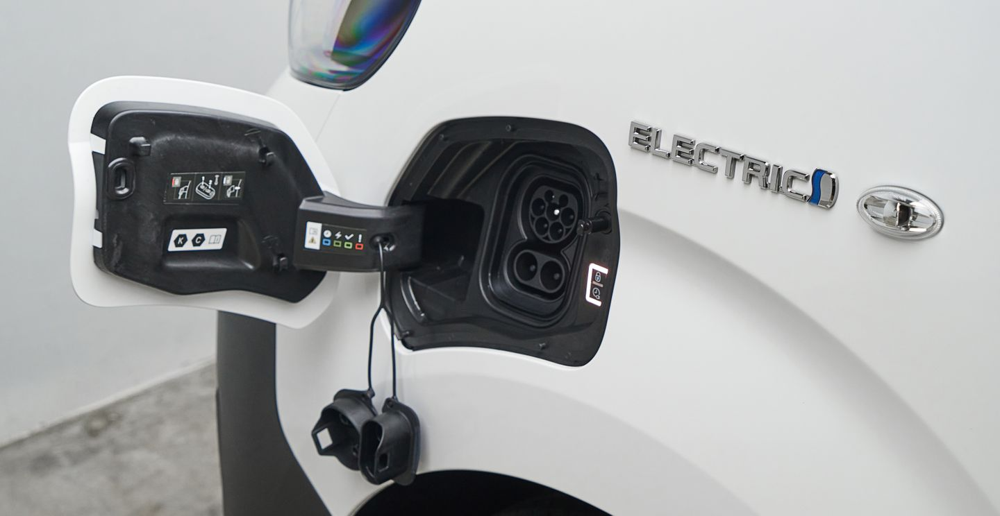

# charging processes
## start charge process:
1. unlock vehicle (press "unlock" button on car key) 
2. insert charging cable into port 
   &rarr;
3. tap card at ((o)) to start charging 
   - 
   - at this point, the car will latch onto the cable to prevent it from falling out
   - you will need to press "unlock" on car key to release the latch
   - 
   - (after a while, door will lock automatically)
4. view your station command ctr or charging order to see status 
   
   

## end charge process:
1. tap card at ((o)) 
   
2. to remove, press "unlock" on the car key, and remove the cable. 
   1. 
   2. &larr;
