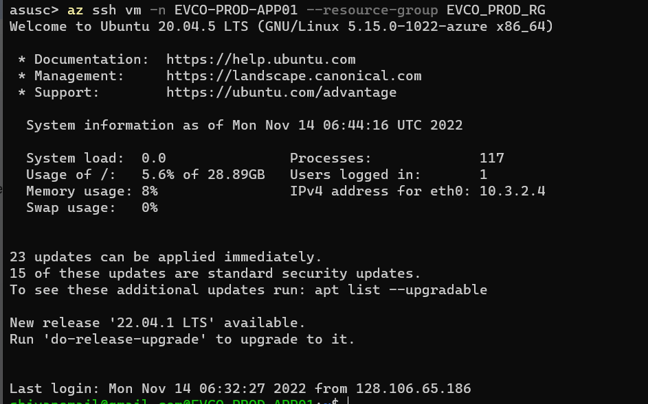

# azure cli login 

## Step 1: install az CLI
---
[follow this link to install.](https://learn.microsoft.com/en-us/cli/azure/install-azure-cli) 

After successfully installing, check your version
```shell
$ az version
``` 

Returns version info
```json
{
  "azure-cli": "2.44.1",
  "azure-cli-core": "2.44.1",
  "azure-cli-telemetry": "1.0.8",
  "extensions": {
    "ssh": "1.1.3"
  }
}
```

## Step 2: Login to account
---
```shell
$ az login
```


it will open a web page for you to login : 


after successful login: 


## STEP 3: 
---
use the following command to login the VM: 
```shell
$ az ssh vm -n EVCO-PROD-APP01 --resource-group EVCO_PROD_RG 
```



# Access the MYSQL DB:

## connect using mysql client
```shell
$ mysql -u mysqladmin -p -h evcoprodmysql01.mysql.database.azure.com --ssl-mode=REQUIRED
```
## from azure docs:


